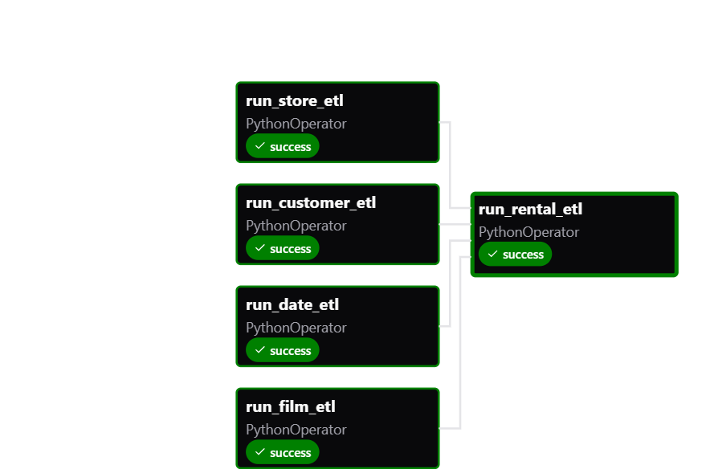

# 📊 Sakila ETL Project

This project implements an **ETL pipeline** that extracts data from the **Sakila MySQL database**, transforms it into a **data warehouse (star schema)**, and loads it into a target database. The process is orchestrated using **Apache Airflow**, and the entire environment is containerized using **Docker**.

---

## 🧱 Star Schema

The target data warehouse uses a **star schema** consisting of:

### 📐 Dimension Tables

- `dim_date`: Contains `full_date`, `rental_month`, `rental_week`
- `dim_film`: Includes `title`, `description`, `length`, `category`
- `dim_store`: Holds `address`, `city`, `state`, `country`
- `dim_client`: Contains customer profile and location

### 📊 Fact Table

- `fact_rental`: Measures total rental `amount`, with foreign keys to all dimensions

---

## 🚀 How It Works

1. **Extract**  
   Queries the Sakila MySQL source database to retrieve raw tables.

2. **Transform**  
   Cleans and restructures the data into dimension and fact tables.

3. **Load**  
   Writes the transformed data into a target data warehouse (e.g., PostgreSQL or SQLite) using SQLAlchemy.

---

## ⚙️ Technologies Used

- **Apache Airflow** for orchestration  
- **Python** for ETL logic  
- **SQLAlchemy** for schema modeling and data insertion  
- **Docker + Docker Compose** for containerization  
- **Pandas** for data transformations  
- **MySQL** as source and data warehouse  
- **Streamlit + Plotly** for interactive dashboarding  

---

## 📋 Airflow DAG

The DAG `rental_etl_dag` manages task dependencies in the following order:



---

## 📊 Interactive Dashboard

An interactive **Streamlit dashboard** is provided to explore rental insights, revenue trends, customer behavior, and store/film performance. It connects directly to the `sakila_dw` data warehouse and provides:

- **KPIs**: Total revenue, rentals, customer count, film count
- **Monthly trends** of revenue and rentals
- **Top 10 performing films and stores**
- **Geographical breakdowns** using Plotly maps
- **Customer segmentation** by city and revenue
- **Dynamic filtering** by category and country
- **Tabbed views** for exploring raw data

To run the dashboard:

```bash
streamlit run streamlit_dashboard.py
